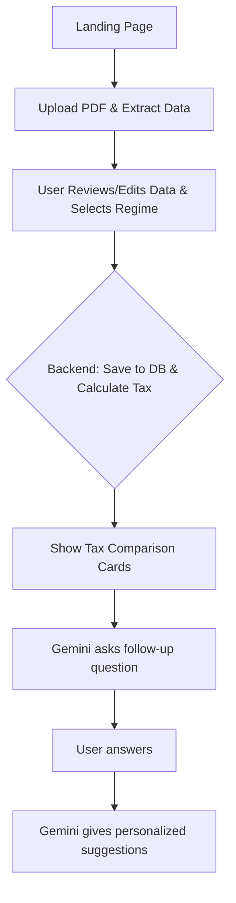

## Tax Advisor Application - Master Plan (V2)

### 1. Overview
A web-based platform for salaried individuals to analyze tax liabilities and receive personalized, AI-powered tax-saving strategies. Users upload their salary slip or Form 16, review/enter data, compare tax regimes, and get actionable investment advice from Gemini.

### 2. Target Audience
- **Primary Users:** Salaried employees (India) with Pay Slips or Form 16.
- **Use Case:** Understand tax liabilities, optimize investments, and learn tax-saving techniques.

### 3. Core Features & User Flow

#### **Step 1: Landing Page**
- Modern, branded landing page with a "Start" button to begin the process.

#### **Step 2: PDF Upload & Data Extraction**
- User uploads a Pay Slip or Form 16 (PDF).
- The backend extracts data using a combination of `PyPDF2`, `pytesseract` (for OCR), and the `Gemini` LLM for structuring the data.
- The user is presented with a form pre-filled with the extracted data for review and editing.
- The user selects their preferred tax regime (Old/New) via a radio button.

#### **Step 3: Tax Calculation & Comparison**
- The backend calculates the tax liability for both regimes based on the verified data.
- Results are displayed in two visually distinct cards (Old vs. New Regime), with the user's selected regime highlighted.
- The financial data is saved to the Supabase database with a unique session ID.

#### **Step 4: AI-Powered Advisor (Gemini)**
- Based on the user's data, Gemini proactively asks a smart, contextual follow-up question.
- After the user answers, Gemini provides personalized, actionable investment and tax-saving suggestions in a modern, readable card format.

### 4. Unified Tech Stack
| Component | Technology |
|---|---|
| Frontend | Vanilla HTML, CSS (Aptos Display font), JavaScript |
| Backend | Python (FastAPI) |
| **Database** | **Supabase (Cloud PostgreSQL, direct psycopg2 connection)** |
| File Storage | Render Ephemeral Disk (for temporary PDF storage) |
| **PDF Processing** | **PyPDF2, pytesseract, pdf2image** |
| AI/Conversational UI | Google Gemini Flash API |
| Deployment | **Render (from GitHub)** |

### 5. Data Model (Supabase)
**Table in Supabase: `UserFinancials`**
| Column Name | Data Type | Description |
|---|---|---|
| `session_id` | `UUID` | Primary Key, unique session identifier |
| `gross_salary` | `NUMERIC(15, 2)` | Total gross salary |
| `basic_salary` | `NUMERIC(15, 2)` | Basic salary component |
| `hra_received` | `NUMERIC(15, 2)` | HRA received |
| `rent_paid` | `NUMERIC(15, 2)` | Annual rent paid |
| `deduction_80c` | `NUMERIC(15, 2)` | 80C investments |
| `deduction_80d` | `NUMERIC(15, 2)` | 80D medical insurance |
| `standard_deduction` | `NUMERIC(15, 2)` | Standard deduction |
| `professional_tax` | `NUMERIC(15, 2)` | Professional tax paid |
| `tds` | `NUMERIC(15, 2)` | Tax Deducted at Source |
| `created_at` | `TIMESTAMPTZ` | Record creation timestamp |

### 6. UI/UX Principles
- **Modern, light theme with blue highlights.**
- **Typography: Use the "Aptos Display" font for a distinct look.**
- **Multi-page Flow:** A clear, step-by-step journey: Landing → Upload/Review → Tax Results → AI Suggestions.
- Responsive, accessible, and visually appealing design.

### 7. Security & Privacy
- Session-based data storage using UUIDs.
- No persistent file storage; PDFs are deleted from the ephemeral disk after processing.
- All secrets and credentials stored as environment variables in Render.
- HTTPS enforced in production.

### 8. Development Stages & Milestones

#### **STAGE 1: Complete Local Development (with Supabase)**
| Phase | Deliverable/Feature | Acceptance Criteria |
|---|---|---|
| Phase 1 | Project setup, DB schema, landing page | User sees the landing page, and the `UserFinancials` table exists in Supabase. |
| Phase 2 | PDF upload, extraction, and manual data review | User can upload a PDF and review/edit the auto-extracted data in a form. |
| Phase 3 | Tax calculation engine, regime comparison UI | User sees the tax comparison cards, and the data is successfully saved to the database. |
| Phase 4 | Gemini-powered advisor (Q&A, suggestions) | User receives a relevant follow-up question and then gets personalized AI suggestions. |

#### **STAGE 2: Production Deployment (GitHub → Render)**
| Phase | Tasks | Goal |
|---|---|---|
| Phase 5 | GitHub Repository Setup & Code Push | Version control established |
| Phase 6 | Render Integration & Environment Configuration | Production environment setup |
| Phase 7 | Production Testing & Optimization | Verified production deployment |
| Phase 8 | (Future) Session retrieval, admin analytics | User/admin can view past sessions. |

### Phase 3: Tax Calculation Engine & Regime Comparison UI

#### Objective
Enable users to view a clear, side-by-side comparison of their tax liabilities under both the Old and New tax regimes, based on their provided/verified financial data. Ensure the calculated data is saved to the database for future reference.

#### User Stories
- As a user, I want to see my tax calculated for both regimes so I can make an informed choice.
- As a user, I want the UI to clearly highlight the regime I select.
- As a user, I want my financial data and calculation results to be saved securely.

#### Features
- Tax calculation logic for both Old and New regimes (FY 2024-25 slabs).
- Backend endpoint to receive user data and return tax calculations for both regimes.
- UI: Two visually distinct cards showing Old vs. New regime results, with the selected regime highlighted.
- Save all relevant data and results to the Supabase database with a unique session ID.
- Error handling for invalid or incomplete data.

#### Backend Requirements
- Implement `/api/calculate-tax` endpoint:
  - Accepts user financial data (session_id, salary components, deductions, regime selection).
  - Calculates tax for both regimes using the correct slabs and deductions.
  - Returns a JSON response with detailed breakdowns for both regimes.
  - Saves the calculation results to the `UserFinancials` table in Supabase.
- Ensure all calculations use the latest FY 2024-25 rules (see Appendix A).

#### Frontend Requirements
- After user reviews/edits their data and selects a regime, submit to `/api/calculate-tax`.
- Display two cards: one for Old Regime, one for New Regime.
- Highlight the user's selected regime.
- Show breakdown: gross income, deductions, taxable income, tax, cess, total liability.
- Provide a clear call-to-action to proceed to the AI-powered advisor (Phase 4).

#### Acceptance Criteria
- User sees both regimes' tax calculations in a clear, side-by-side UI.
- User's selected regime is visually highlighted.
- All calculation data is saved to the database with the session ID.
- Calculations match the FY 2024-25 rules in Appendix A.
- Errors are handled gracefully and communicated to the user.

#### Notes
- Use the tax slab and deduction logic as detailed in Appendix A.
- Ensure the UI is responsive and visually consistent with previous phases.
- Prepare for integration with the AI-powered advisor in Phase 4.

### 9. Implementation Details
| Component | Specification |
|---|---|
| **API Routes** | `/api/upload-pdf`, `/api/calculate-tax`, `/api/chat` |
| Environment Variables | Render Environment Variables for all secrets. |
| **Database Connection** | Direct connection to Supabase via `psycopg2`. |
| GitHub Integration | Automatic deployment on push to the main branch. |

### 10. Appendix A: Tax Calculation Logic (FY 2024-25)
*(This section details the Old and New tax regime slabs and deductions.)*

#### **Old Tax Regime**
* **Deductions:** Standard Deduction (₹50k), HRA, Professional Tax, 80C, 80D, etc.
* **Slabs:** 0% up to ₹2.5L, 5% up to ₹5L, 20% up to ₹10L, 30% above.

#### **New Tax Regime (Default)**
* **Deductions:** Standard Deduction (₹50k) only.
* **Slabs:** 0% up to ₹3L, 5% up to ₹6L, 10% up to ₹9L, 15% up to ₹12L, 20% up to ₹15L, 30% above.
* *A 4% cess applies to the final tax amount in both regimes.*

### 11. Application Flow Diagram
